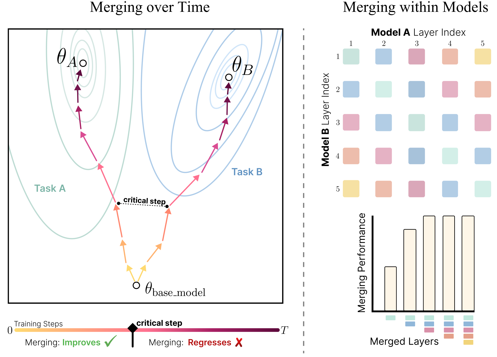
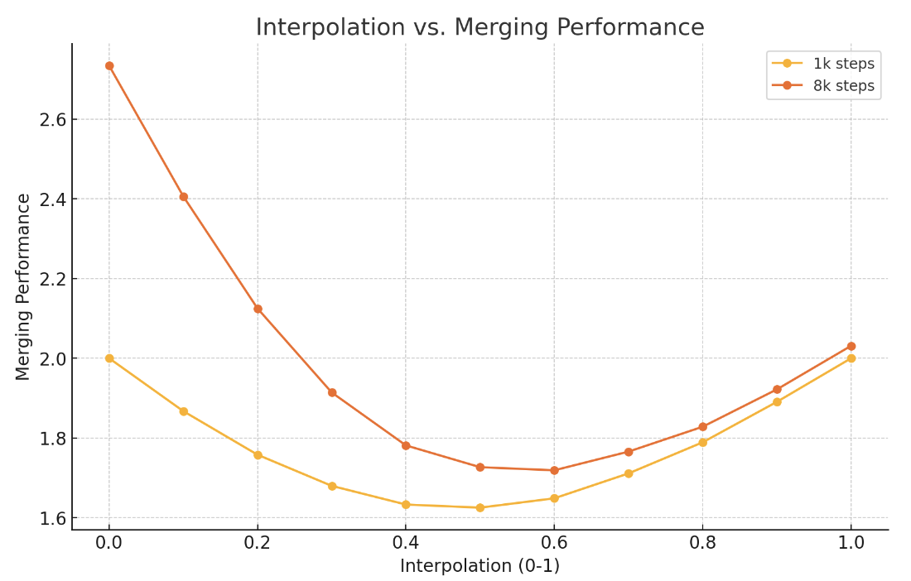
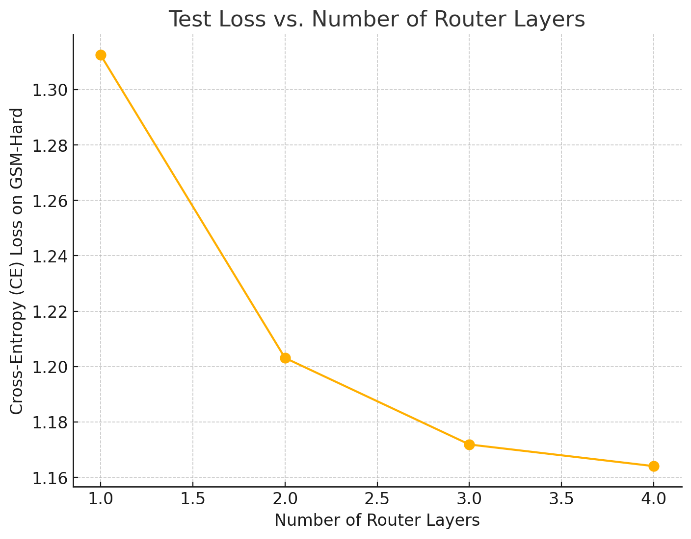

# Compatible Specalization Experiments


This repository allows you to reproduce the key results for our paper. 

> **Collective Model Intelligence Requires Compatible Specialization**  
> by [Jyothish Pari](https://jyopari.github.io/), [Samy Jellasi](https://sjelassi.github.io/), [Pulkit Agrawal](https://people.csail.mit.edu/pulkitag/)   
> [Link to Paper](link) \
> [Link to Website](link)




## Installation

To run the code, clone this repository and install the required packages:

```bash
git clone https://github.com/your-username/repo-name.git
cd repo-name
pip install -r requirements.txt
```

Downlaod the checkpoints here [link](link)

## Experiments
We will section the experiments in two parts, one being compatible speclization over time, and the other being within models. We will focus on merging a `math` finetuned LM with a `coding` finetuned LM to model [gsm-hard](https://huggingface.co/datasets/reasoning-machines/gsm-hard)

**Evaluating models**

Code Model 
```bash
python main.py --arch gpt2 \
            --dataset tinycodes --batch_size 16 --context 1024 \
            --eval --chkpt /data/scratch-oc40/pulkitag/jyop/gpt-merge-out/gpt2-tinycodes-gpt2-0.0008-1-tinycodes_finetuned.pt
```
`>>>Test loss:       0.7803825736045837`

Math Model 
```bash
python main.py --arch gpt2 \
            --dataset orca-math-problems --batch_size 16 --context 1024 \
            --eval --chkpt /data/scratch-oc40/pulkitag/jyop/gpt-merge-out/gpt2-orca-math-gpt2-0.0008-1-orca-math-problems_finetuned.pt
```
`>>> Test loss:       0.7164799571037292`

**Early Checkpoint 1000 steps**

Code Model  
```bash
python main.py --arch gpt2 \
            --dataset tinycodes --batch_size 16 --context 1024 \
            --eval --chkpt /data/scratch-oc40/pulkitag/jyop/gpt-merge-out/gpt2-tinycodes-gpt2-0.0008-1-tinycodes_560000_step-1000_finetuned.pt
```
`>>> Test loss:       0.875899612903595`

Math Model
```bash
python main.py --arch gpt2 \
            --dataset orca-math-problems --batch_size 16 --context 1024 \
            --eval --chkpt /data/scratch-oc40/pulkitag/jyop/gpt-merge-out/gpt2-orca-math-gpt2-0.0008-1-orca-math-problems_560000_step-1000_finetuned.pt
```
`>>>Test loss:       0.8461267948150635`

**Later Checkpoint 8000 steps**

Code Model  
```bash
python main.py --arch gpt2 \
            --dataset tinycodes --batch_size 16 --context 1024 \
            --eval --chkpt /data/scratch-oc40/pulkitag/jyop/gpt-merge-out/gpt2-tinycodes-gpt2-0.0008-1-tinycodes_560000_step-8000_finetuned.pt
```
`>>> Test loss:       0.6837776303291321`

Math Model
```bash
python main.py --arch gpt2 \
            --dataset orca-math-problems --batch_size 16 --context 1024 \
            --eval --chkpt /data/scratch-oc40/pulkitag/jyop/gpt-merge-out/gpt2-orca-math-gpt2-0.0008-1-orca-math-problems_560000_step-8000_finetuned.pt
```
`>>>Test loss:       0.6099207401275635`

**Activation Interpolation** 
Early Model 
```bash
python analyze.py --arch gpt2 --pretrained \
            --datasets gsm-hard --batch_size 16 --context 1024 \
            --name eval_gpt2_base \
            --eval_sep gsm-hard \
            --router_ckpts /data/scratch-oc40/pulkitag/jyop/gpt-merge-out/gpt2-tinycodes-gpt2-0.0008-1-tinycodes_560000_step-1000_finetuned.pt \
                           /data/scratch-oc40/pulkitag/jyop/gpt-merge-out/gpt2-orca-math-gpt2-0.0008-1-orca-math-problems_560000_step-1000_finetuned.pt \
            --analyze
```
<!-- ```{(0, 'gsm-hard'): 2.0, (0.1, 'gsm-hard'): 1.8671875, (0.2, 'gsm-hard'): 1.7578125, (0.3, 'gsm-hard'): 1.6796875, (0.4, 'gsm-hard'): 1.6328125, (0.5, 'gsm-hard'): 1.625, (0.6, 'gsm-hard'): 1.6484375, (0.7, 'gsm-hard'): 1.7109375, (0.8, 'gsm-hard'): 1.7890625, (0.9, 'gsm-hard'): 1.890625, (1, 'gsm-hard'): 2.0}``` -->

Later Model
```bash
python analyze.py --arch gpt2 --pretrained \
            --datasets gsm-hard --batch_size 16 --context 1024 \
            --name eval_gpt2_base \
            --eval_sep gsm-hard \
            --router_ckpts /data/scratch-oc40/pulkitag/jyop/gpt-merge-out/gpt2-tinycodes-gpt2-0.0008-1-tinycodes_560000_step-8000_finetuned.pt \
                           /data/scratch-oc40/pulkitag/jyop/gpt-merge-out/gpt2-orca-math-gpt2-0.0008-1-orca-math-problems_560000_step-8000_finetuned.pt \
            --analyze
```
<!-- ```{(0, 'gsm-hard'): 2.734375, (0.1, 'gsm-hard'): 2.40625, (0.2, 'gsm-hard'): 2.125, (0.3, 'gsm-hard'): 1.9140625, (0.4, 'gsm-hard'): 1.78125, (0.5, 'gsm-hard'): 1.7265625, (0.6, 'gsm-hard'): 1.71875, (0.7, 'gsm-hard'): 1.765625, (0.8, 'gsm-hard'): 1.828125, (0.9, 'gsm-hard'): 1.921875, (1, 'gsm-hard'): 2.03125}``` -->



**MoE Routing**

Routing Results for early Model 
```bash 
python main.py --arch gpt2 --pretrained \
            --datasets gsm-hard --batch_size 92 --context 1024 --train_tokens 160000 \
            --optim adamw --lr 5e-3 --wd 1e-1 --name gpt2_route --router_method standard --topk 2 \
            --router_ckpts /data/scratch-oc40/pulkitag/jyop/gpt-merge-out/gpt2-code_instructions-gpt2-0.0008-1-code_instructions_finetuned.pt \
                           /data/scratch-oc40/pulkitag/jyop/gpt-merge-out/gpt2-tinycodes-gpt2-0.0008-1-tinycodes_finetuned.pt \
            --chkpt /data/pulkitag/models/jyop/code/compatible_specialization/out/gpt_routed_gsm-hard-1k-gpt2-0.005-2-False-gsm-hard_routed.pt \
            --name gpt_routed --eval
```
note that the router_ckpts are just random base model checkpoints to create the MoE model, then we can load the actual checkpoint. 
`>>> Test loss:       1.328125`

Routing Results for later Model 
```bash 
python main.py --arch gpt2 --pretrained \
            --datasets gsm-hard --batch_size 92 --context 1024 --train_tokens 160000 \
            --optim adamw --lr 5e-3 --wd 1e-1 --name gpt2_route --router_method standard --topk 2 \
            --router_ckpts /data/scratch-oc40/pulkitag/jyop/gpt-merge-out/gpt2-code_instructions-gpt2-0.0008-1-code_instructions_finetuned.pt \
                           /data/scratch-oc40/pulkitag/jyop/gpt-merge-out/gpt2-tinycodes-gpt2-0.0008-1-tinycodes_finetuned.pt \
            --chkpt /data/pulkitag/models/jyop/code/compatible_specialization/out/gpt_routed_gsm-hard-8k-gpt2-0.005-2-False-gsm-hard_routed.pt \
            --name gpt_routed --eval
```
`>>>Test loss:       1.34375`


### Compatible Speclization within Models 

Multi Layer Routing 

Baseline 
```bash 
python main.py --arch gpt2 --pretrained \
            --datasets gsm-hard --batch_size 92 --context 1024 --train_tokens 160000 --grad_accum 4\
            --optim adamw --lr 5e-3 --wd 1e-1 --router_method standard --topk 2 --multi_layer_router --num_multi_layer_experts 1\
            --router_ckpts /data/scratch-oc40/pulkitag/jyop/gpt-merge-out/gpt2-tinycodes-gpt2-0.0008-1-tinycodes_finetuned.pt \
                           /data/scratch-oc40/pulkitag/jyop/gpt-merge-out/gpt2-orca-math-gpt2-0.0008-1-orca-math-problems_finetuned.pt \
            --name gpt_routed_multi_layer_cleaned_1 --eval --chkpt /data/pulkitag/models/jyop/code/compatible_specialization/out/gpt_routed_multi_layer_cleaned_1-gpt2-0.005-2-False-gsm-hard_routed.pt
```
`>>>Test loss:       1.3125`

2 Layer Routing 
```bash 
python main.py --arch gpt2 --pretrained \
            --datasets gsm-hard --batch_size 92 --context 1024 --train_tokens 160000 --grad_accum 4\
            --optim adamw --lr 5e-3 --wd 1e-1 --router_method standard --topk 4 --multi_layer_router --num_multi_layer_experts 2\
            --router_ckpts /data/scratch-oc40/pulkitag/jyop/gpt-merge-out/gpt2-tinycodes-gpt2-0.0008-1-tinycodes_finetuned.pt \
                           /data/scratch-oc40/pulkitag/jyop/gpt-merge-out/gpt2-orca-math-gpt2-0.0008-1-orca-math-problems_finetuned.pt \
            --name gpt_routed_multi_layer_cleaned_1 --eval --chkpt /data/pulkitag/models/jyop/code/compatible_specialization/out/gpt_routed_multi_layer_cleaned_2-gpt2-0.005-4-False-gsm-hard_routed.pt
```
`>>>Test loss:       1.203125`

3 Layer Routing 
```bash 
python main.py --arch gpt2 --pretrained \
            --datasets gsm-hard --batch_size 92 --context 1024 --train_tokens 160000 --grad_accum 4\
            --optim adamw --lr 5e-3 --wd 1e-1 --router_method standard --topk 6 --multi_layer_router --num_multi_layer_experts 3\
            --router_ckpts /data/scratch-oc40/pulkitag/jyop/gpt-merge-out/gpt2-tinycodes-gpt2-0.0008-1-tinycodes_finetuned.pt \
                           /data/scratch-oc40/pulkitag/jyop/gpt-merge-out/gpt2-orca-math-gpt2-0.0008-1-orca-math-problems_finetuned.pt \
            --name gpt_routed_multi_layer_cleaned_1 --eval --chkpt /data/pulkitag/models/jyop/code/compatible_specialization/out/gpt_routed_multi_layer_cleaned_3-gpt2-0.005-6-False-gsm-hard_routed.pt
```
`>>>Test loss:       1.171875`

4 Layer Routing 
```bash 
python main.py --arch gpt2 --pretrained \
            --datasets gsm-hard --batch_size 92 --context 1024 --train_tokens 160000 --grad_accum 4\
            --optim adamw --lr 5e-3 --wd 1e-1 --router_method standard --topk 8 --multi_layer_router --num_multi_layer_experts 4\
            --router_ckpts /data/scratch-oc40/pulkitag/jyop/gpt-merge-out/gpt2-tinycodes-gpt2-0.0008-1-tinycodes_finetuned.pt \
                           /data/scratch-oc40/pulkitag/jyop/gpt-merge-out/gpt2-orca-math-gpt2-0.0008-1-orca-math-problems_finetuned.pt \
            --name gpt_routed_multi_layer_cleaned_1 --eval --chkpt /data/pulkitag/models/jyop/code/compatible_specialization/out/gpt_routed_multi_layer_cleaned_4-gpt2-0.005-8-False-gsm-hard_routed.pt
```
`>>>Test loss:       1.1640625`

